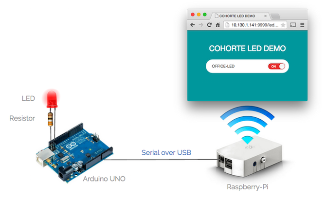
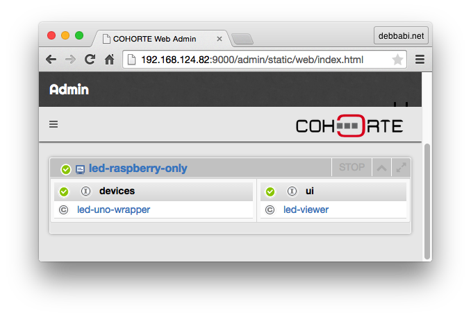

The objective of this demonstration is to show you how control an Arduino UNO using COHORTE. In particular, we will export the functionality provided by the Arduino as a Service and then use this service as a representative component of the Arduino. This avoid as to implement low level routines to control the Arduino and allow a seamless integration with other application components (using remote services).

You can download the provided COHORTE node using the following link :

<a id="download_arduino_led_snapshot" href="#" class="btn btn-success">Download Arduino LED Demo</a>

## Application

## Architecture

## Code

### Arduino code


int led = 13;

void setup() {
  pinMode(led, OUTPUT);
  Serial.begin(9600);
  Serial.flush();
}

void loop() {
  String input = "";
  while(Serial.available() > 0)
  {
    input += (char) Serial.read();
    delay(5);
  }
  if (input == "on")
  {
    digitalWrite(led, HIGH);
  }
  else if (input == "off")
  {
    digitalWrite(led, LOW);
  }
}


### Raspberry code

#### LED_WRAPPER


from pelix.ipopo.decorators import ComponentFactory, Provides, Validate, Invalidate

import serial

@ComponentFactory("led_wrapper_factory")
@Provides("led.service")
class LedWrapper(object):

    def __init__(self):
        self._state = "off"
        self._serial = None
        
    @Validate    
    def start(self, context):
        self._serial = serial.Serial('/dev/tty.usbmodem1d1131', 9600, timeout=5)

    @Invalidate    
    def stop(self, context):
        self._serial.close()
        self._serial = None

    def get_state(self):
        return self._state

    def on(self):             
        if self._serial.isOpen():
            self._serial.write("on")
            self._state = "on"            

    def off(self):        
        if self._serial.isOpen():
            self._serial.write("off")
            self._state = "off"


You have to change the provided serial port `/dev/tty.usbmodem1d1131` into the concrete port used by your Arduino.

#### VIEWER


from pelix.ipopo.decorators import ComponentFactory, Provides, Requires, Property
import pelix.remote
import os
import json

@ComponentFactory("led_viewer_factory")
@Provides('pelix.http.servlet')
@Requires("_led", "led.service", optional=True)
@Property('_path', 'pelix.http.path', "/leds")
@Property('_reject', pelix.remote.PROP_EXPORT_REJECT, ['pelix.http.servlet'])
class Viewer(object):

    def __init__(self):
        self._path = None
        self._led = None        

    def get_led(self):
        if self._led:
            return {"state": self._led.get_state()}
        else:
            return {"state": "unknown"}

    def send_action(self, action):
        if self._led:
            if action == "on":
                self._led.on()
            elif action == "off":
                self._led.off()
        return self.get_led()

    # we have omitted the remaining code handling HTTP requests for clarity    


## Running

* Ensure to have COHORTE [installed]({{site.baseurl}}/docs/1.x/setup) in your system (raspberry).

* Go to `led-gateway` folder of the downloaded zip file and launch COHORTE node: 

<pre>
$ ./<b>run</b>
</pre>

* Open a web browser with the following address: `http://localhost:9000/admin`

* Click on the `app-isolate` isolate which contains the `led-viewer` component, and then click on the *HTTP SERVICE* link on the showed modal window. This will open the http server page of this isolate on which a list of the published servlets is showed. Ckick on `/leds` link to access the `led-viewer` page.
Viewer web page :

You can control now the LED of the Arduino using the ON/OFF button of the web interface. 

## Final remarks 

* You can give a static url path to your viewer's container so that you can access it using your web mobile browser without retyping the url each time.
* We can deploy the viewer anywhere we want. If your deployment infrastructure is limited to a local network area, you can start COHORTE in HTTP mode. 
* You can add an intermediate component that controls a set of LEDs (or Arduinos). This depends on your needs for one specific scenario. Thanks to COHORTE your Arduino is seen as a service which can be consumed locally or remotely with no supplemental efforts. 

