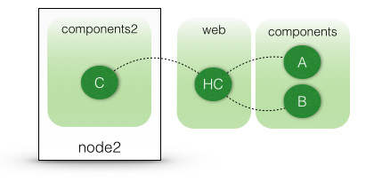

[Home](../../../../) > [Documentation](../../) > [Tutorials](../)

## Getting started tutorial

### Step 1

`step1/autorun_conf.js`

{
	"name" : "hello-demo-app-step1",
	"root" : {
		"name" : "hello-demo",
		"components" : [ {
			"name" : "hello_components",
			"factory" : "hello_components_factory",
			"language" : "python"
		}, {
			"name" : "component_A",
			"factory" : "component_A_factory",
			"language" : "python"
		}, {
			"name" : "component_B",
			"factory" : "component_B_factory",
			"language" : "python"
		} ]
	}
}


### Step 2

`step2/autorun_conf.js`

{
	"name" : "hello-demo-app-step2",
	"root" : {
		"name" : "hello-demo",
		"components" : [ {
			"name" : "hello_components",
			"factory" : "hello_components_factory",
			"language" : "python",
			"node" : "node1"
		}, {
			"name" : "component_A",
			"factory" : "component_A_factory",
			"language" : "python",
			"node" : "node1"
		}, {
			"name" : "component_B",
			"factory" : "component_B_factory",
			"language" : "python",
			"node" : "node2"
		} ]
	}
}


If the two COHORTE nodes are located on the same physical machine, you should override the HTTP service port.

`node2/conf/boot-forker.js

{
	"import-files" : [ "boot-forker.js" ],

	"composition" : [
	{
		"name" : "pelix-http-service",
		"properties" : {
			"pelix.http.port" : 9000
		}
	}, {
		"name" : "pelix-remote-shell",
		"properties" : {
			"pelix.shell.port" : 9001
		}
	} ]
}


[Home](../../../../) > [Documentation](../../) > [Tutorials](../)
