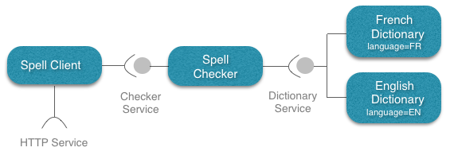
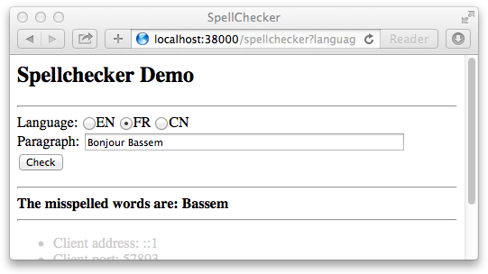

[Home](../../../../) > [Documentation](../../) > [Tutorials](../) > [Spellchecker](./)

## COHORTE for Java

Welcome to COHORTE for Java! With COHORTE, you can build modular and resilient applications using the Java programming language, and take advantage of the many benefits of the COHORTE approach (see [what is COHORTE?]({{ site.baseurl}}/docs/1.x/what-is-cohorte)).

Note

    If you are already familiar with <a href="http://www.osgi.org">OSGi</a>, COHORTE components are a simple <a href="http://felix.apache.org/documentation/subprojects/apache-felix-ipojo.html">Apache Felix iPOJO</a> components. The only thing you should do is to not instantiate your components manually, COHORTE will do it for you and add <a href="{{ site.baseurl }}/docs/1.x/what-is-cohorte">many features</a> to your final application .

### Spellchecker application

The application to develop in this tutorial provides a web interface in which users can check the spell of their sentences in one or another language. It concists of three main type of components as shown in the following picture:

 

1. **Dictionary components**: implementing and providing the *Dictionary Service*. Each implementation indicates the language of the dictionary as a service property.
2. **Spell Checker**: implements the *Checker Service* which take as input a sentence of words, and by using the *Dictionary Service* it verifies the existance of misspelled words. It uses the adequate provided *Dictionary Service*s depending on user language choice. A list of missplened words are returned by this service.
3. **Spell Client**: is a simple web interface that shows a form to the final user to test the application. This component uses the *Checker Service* for the application's logic part, and it also requires an *HTTP Service* to publish the web interface and response to the form requests initiated by the user.

The required *HTTP Service* for the last component **Spell Client** is provided natively by the COHORTE runtime. No need to implement it! In the following, we show you how the different components are implemented in Python or Java programming languages.

### Setup

The first thing we need to do is to set up the development environment. We will be using [Apache Maven](http://maven.apache.org), although you can use whatever build tool you feel confortable using. If you wish to use something else to build this tutorial (such as Ant), you will need to manually account for all the needed dependencies. In <a href="{{ site.baseurl }}/docs/1.x/ide">this page</a>, we detail different possible development environments setup.

In the next section, we will use COHORTE maven tools to generate and compile COHORTE components. You need to install Maven and configure it to use our provided tools. Read more about using Maven in the official website [http://maven.apache.org/](http://maven.apache.org/).

Add the two blocks of code to the file `settings.xml` (usually in your Maven `conf` of `$HOME/.m2` directory, create it if not present)

This will have Maven allow you to execute COHORTE plugins:


<settings>
	<pluginGroups>
		<pluginGroup>org.cohorte.plugins</pluginGroup>
	</pluginGroups>
	...
</settings>


This will tell your Maven instance where to find the COHORTE repositories:


<profile>
    <id>Cohorte Org</id>
    <activation>
        <activeByDefault>true</activeByDefault>
    </activation>
    <repositories>
        <repository>
            <id>cohorte-releases</id>
            <name>Cohorte Repository</name>
            <url>http://repo.isandlatech.com/maven/releases/</url>
            <layout>default</layout>
        </repository>
        <repository>
            <id>cohorte-snapshots</id>
            <name>Cohorte Snapshot Repository</name>
            <url>http://repo.isandlatech.com/maven/snapshots/</url>
            <layout>default</layout>
        </repository>
    </repositories>
</profile>z


### Creating COHORTE project template

To create a project, simply type the following command. If this is your first time running this command, Maven downloads the archetype for you.


mvn archetype:generate \
-DarchetypeGroupId=org.cohorte \
-DarchetypeArtifactId=cohorte-java-archetype \
-DarchetypeVersion=1.0.0 \
-DgroupId=org.cohorte.demos \
-DartifactId=spellchecker \


This command will generate a project template for a COHORTE project **spellchecker** which has the following structure:

 * `pom.xml`: an XML file that contains information about the project and configuration details used by Maven to build the project. 
 * `src/main/java/`: this folder contains the java source files of your bundle
 * `src/test/java/`: this folder contains the test classes of your bundle.
    
> Any maven project is identified by it groupId, artifactId, and version number. You find this information in the `pom.xml`file. Any dependencies to other libraries should be declared also in the `pom.xml`file. Maven retrieve them automatically when compiling the project.

### Running your application

To start running your awesome first COHORTE application, you need to [download](../../downloads) and install the COHORTE runtime platform in your local machine (see the [setup section of the reference guide]({{ site.baseurl }}/documentation/reference-guide/setup.html) for more information). 

In the following, we suppose that you have a Max OS X platform. Download the archive file of the COHORTE runtime from the [downloads page]({{ site.baseurl}}/downloads) (e.g., cohorte-1.0.0-macosx.tar.gz).

Extract the dowloaded file anywhere in your file system and create the *environment Variable* **$COHORTE_HOME** which has as value the fullpath to `home` sub-folder of the extracted archive file (note that you can just double click on `home/setup.command` file to setup this environment variable).

The `home` sub-folder contains the main COHORTE runtime libraries and configuration files. Whereas the `base` folder contains user-specific bundles and configurations. To run your spellchecker application you need to:

 * move your spellchecker package folder to `base/repo` folder.
 * fill the `base/conf/autorun_conf.js` file with the description of application's components to be instantiated (see more information about [the formalism in the reference guide]({{ site.baseurl }}/documentation/reference-guide/applications.html)).


{
    "name" : "spellchecker-demo-app",
    "root" : {
        "name" : "spellchecker-demo",
        "components" : [ {
            "name" : "dictionary_en",
            "factory" : "dictionary_en_factory",
            "language" : "java"
        }, {
            "name" : "dictionary_fr",
            "factory" : "dictionary_fr_factory",
            "language" : "java"
        }, {
            "name" : "checker",
            "factory" : "checker_factory",
            "language" : "java"
        }, {
            "name" : "spell_client",
            "factory" : "client_factory",
            "language" : "java"
        } ]
    }
}


This description defines a new application named `spellchecker-demo-app`on which four components will be instantiated. The wiring between the different components is done automatically following the service-oriented architecture (service providers and service consumers) even if one component is placed in remote nodes (see [COHORTE applications reference guide]({{ site.baseurl }}/documentation/reference-guide/applications.html) for more information on how to personalise your application's architecture). 

By default, with this minimal description, all the components will be instantiated in one Python isolate (as all the components are implemented in Python). Recall that a COHORTE Isolate is a seperate process (or a gateway) executing a set of components. The Python Isolate consists in Pelix platform hosting your different bundles as well as the needed system bundles (including the HTTP service provider). 

COHORTE runtime components managing your application's isolates and the distribution of components among them are located on a special purpose (static) isolate (called `cohorte-isolate`). There is one `cohorte-isolate`per node, but only one is started as a **Top Isolate** which manage all other isolates.  

Next, you need to launch your application... 


./run.sh -t -c


NOTE

For more setup and startup configurations, please check <a href="{{ site.baseurl }}/docs/1.x/startup">this page</a>.

### Test your application

The resulting Spell Client looks like this:

The important quality of this architecture is the capability to update any component without restarting the global application. This is important to allow adding new *Dictionary Service*s or updating a new efficient version of the **Spell Checker** component, without stopping the system and hence guaranting the continuity of business services.

The different application components can be deployed on different Isolates. This is important to ensure that a failure of one or more components does not affect the other ones. The isolation is managed automatically by COHORTE, this feature is explored with more details in [this tutorial](../temper/).

### Monitoring

[Home](../../) > [Documentation](../) > [Getting Started](../getting-started.html)